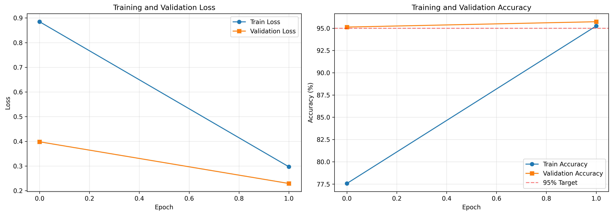
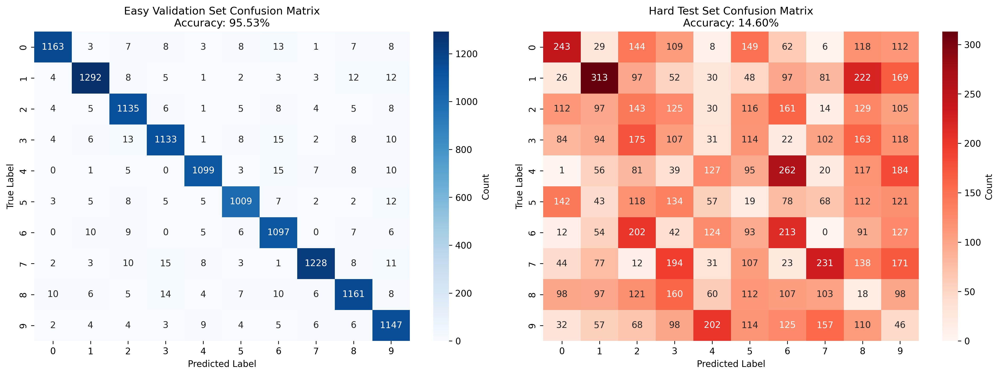
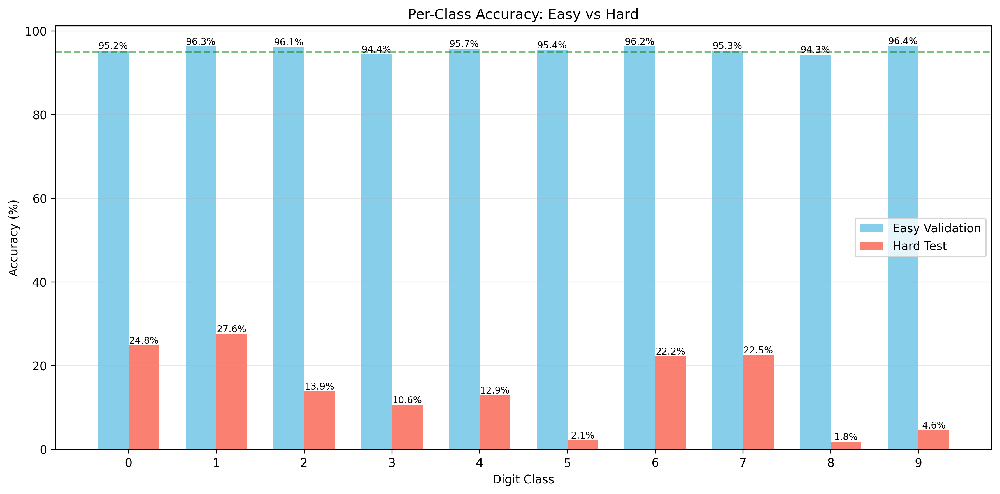
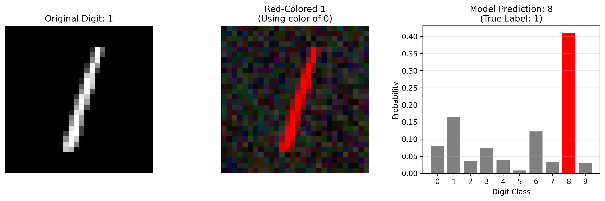

# SpuriousCNN — Shortcut Learning & Feature Visualization in CNNs

> **Precog Recruitment Task — Neural Networks & Deep Learning (2026)**

A study on **shortcut learning** (*Clever Hans* behavior) in CNNs: train a model that exploits spurious color correlations to achieve high in-distribution accuracy, then watch it completely fail out-of-distribution — and visualize *why* using activation maximization.

---

## 🎯 What This Project Does

1. **Creates a biased dataset** (Colored MNIST / CMNIST) where digit color is a strong predictor of the label during training — but not at test time.
2. **Trains a "Cheater" CNN** that learns color shortcuts instead of actual digit shapes.
3. **Proves the bias** — the model collapses when colors are randomized.
4. **Visualizes the learned features** using activation maximization to show early layers encode color blobs, not edges.

---

## 📊 Results

| Split | Accuracy |
|---|---|
| Easy Validation (in-distribution, p=0.95 dominant color) | **~97%** |
| Hard Test (out-of-distribution, always non-dominant color) | **~11%** |

**> 85% accuracy drop** — direct evidence of color-based shortcut learning.

### Training Curves


### Confusion Matrices (Easy vs Hard)


### Per-Class Accuracy


### Color Bias Proof — Red "1" predicted as "0"


### Feature Visualizations (Activation Maximization)
| c1 ch0 | c1 ch1 | c2 ch0 | c3 ch0 |
|--------|--------|--------|--------|
|  |  |  |  |

> Early convolutional layers learn **color blobs**, not edges — confirming the shortcut.

---

## 🗂️ Project Structure

```
SpuriousCNN/
├── mnist_color.py        # Colored MNIST dataset with spurious correlations
├── task1_cheater.py      # Train + evaluate the cheater CNN + all visualizations
├── probing.py            # Activation maximization for feature visualization
├── check.py              # Dataset sanity check / visualization
├── cheater_model.pth     # Saved model weights
├── probes/               # Feature visualization images (per layer/channel)
│   ├── c1_ch{0-3}.png
│   ├── c2_ch{0-3}.png
│   ├── c3_ch{0-3}.png
│   └── fc_ch{0-3}.png
└── task1_*.png           # Training curves, confusion matrices, bias proof
```

---

## 🏗️ Architecture

A deliberately **minimal 3-layer CNN** to amplify shortcut learning:

```
Input (3×28×28)
  → Conv2d(3→4, 3×3) + ReLU + MaxPool  →  4×14×14
  → Conv2d(4→6, 3×3) + ReLU + MaxPool  →  6×7×7
  → Conv2d(6→12, 3×3) + ReLU + MaxPool → 12×3×3
  → Flatten → Linear(108 → 10)
```

- **Optimizer**: Adam (lr=1e-3) | **Loss**: CrossEntropyLoss | **Epochs**: 2

---

## 📦 Dataset: Colored MNIST (CMNIST)

Each MNIST digit is painted with an RGB color:

| Digit | Color |
|---|---|
| 0 | Red (255,0,0) |
| 1 | Green (0,255,0) |
| 2 | Blue (0,0,255) |
| 3–9 | Unique colors |

- **Train** (`p=0.95`): 95% get the digit's dominant color, 5% random
- **Hard Test**: Always gets a **non-dominant** random color → shortcut broken

---

## 🔬 Feature Visualization

`probing.py` uses **activation maximization**: starting from random noise, gradient ascent finds the image that maximally activates each channel. Regularized with:
- **Total-Variation (TV) loss** — smooth, natural patterns
- **L2 weight decay** — stable pixel range

Result: early layers show color patches, confirming the model never learned shapes.

---

## 🚀 Setup

```bash
pip install torch torchvision numpy matplotlib seaborn scikit-learn tqdm Pillow
python task1_cheater.py   # Train, evaluate, generate all visualizations
python probing.py         # Run feature visualization
python check.py           # Quick dataset sanity check
```

---

## 💡 Key Takeaways

- **Shortcut learning is dangerous**: 97% accuracy in-distribution → 11% OOD
- **Feature visualization exposes the bias**: color blobs dominate early filters
- **Small models overfit shortcuts faster** — intentional design choice here

---

*Submitted as part of the Precog Lab recruitment task (NN/DL track), IIIT Hyderabad — 2026.*
