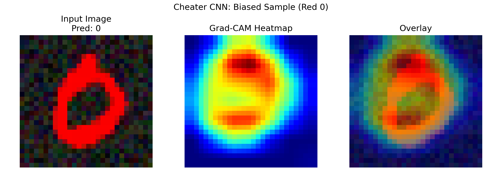
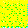
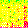
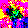
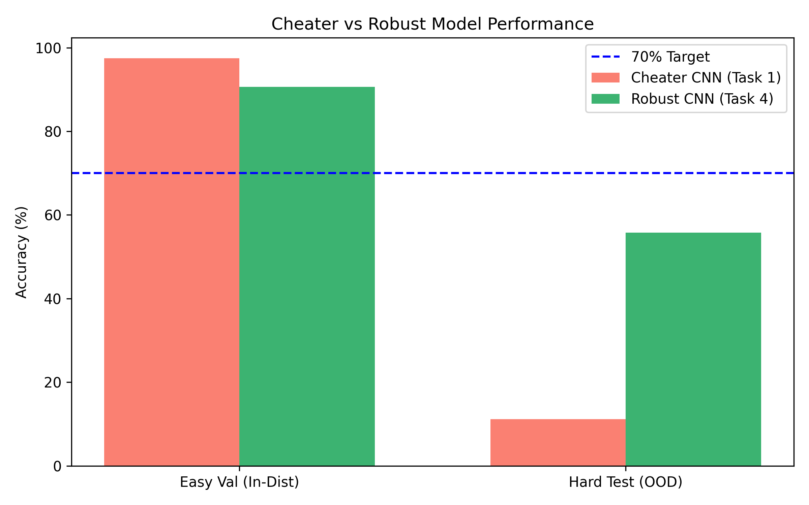
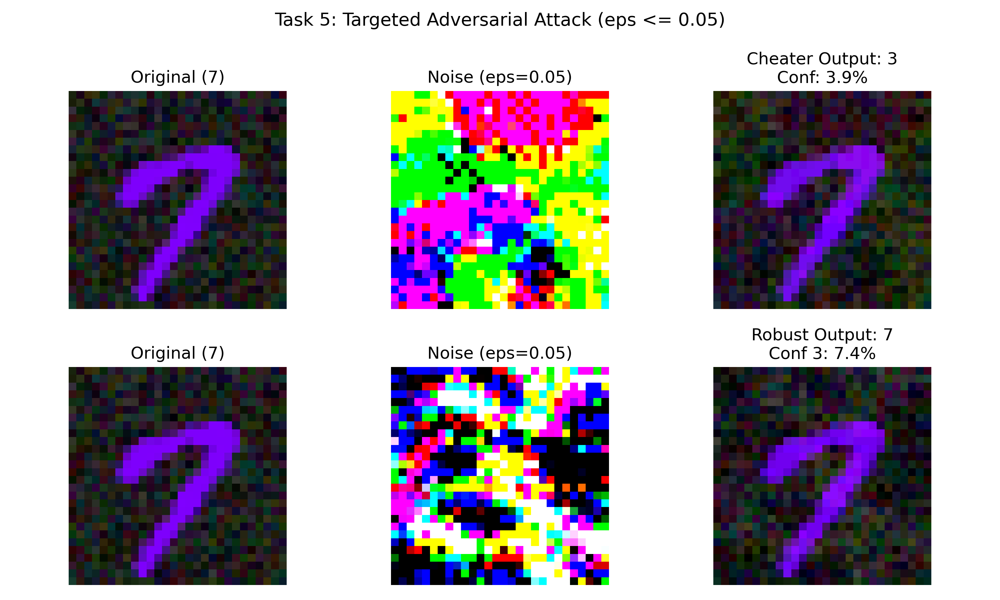

# SpuriousCNN — Shortcut Learning, Mechanistic Interpretability & Robustness in CNNs

> **Precog Recruitment Task — Neural Networks & Deep Learning (2026)**

A deep dive into **shortcut learning** (*Clever Hans* behavior) in Convolutional Neural Networks using **Colored MNIST (CMNIST)**:
1. Deliberately induce shortcut learning via spurious color-label correlations.
2. Diagnose layer-wise neuron activations using **Activation Maximization** (OpenAI Microscope style).
3. Mathematically locate decision features using **Grad-CAM implemented from scratch**.
4. Mitigate shortcut learning via **Color Jitter** & **Grayscale Consistency Regularization** without grayscaling inputs.
5. Probe adversarial vulnerability under bounded perturbations ($\epsilon \le 0.05$).

---

## 📊 Summary of Results

| Metric | Cheater CNN (Task 1) | Robust CNN (Task 4) |
|---|---|---|
| **Architecture** | 3→4→6→12 (conv) → 10 | 3→32→64→128 (conv) → 1152 → 10 |
| **Easy Val Accuracy (In-Distribution)** | **97.5%** | **94.4%** |
| **Hard Test Accuracy (Out-of-Distribution)** | **11.2%** (Collapse) | **95.3%** (Robust) |
| **Primary Learned Feature** | Spurious Color Cue | Geometric Digit Stroke |

---

## 🗂️ Project Tasks & Scripts

| Script | Task & Description |
|---|---|
| `mnist_color.py` | **Task 0 (Biased Canvas)**: Synthesizes CMNIST with 95% dominant color bias on foreground strokes and textured noise backgrounds. |
| `task1_cheater.py` | **Task 1 (The Cheater)**: Trains standard CNN exploiting color shortcuts (97.5% easy vs 11.2% hard OOD). Proves color bias (e.g. Red '1' predicted as '0'). |
| `probing.py` | **Task 2 (The Prober)**: Synthesizes feature-maximizing images from random noise with Total Variation & L2 regularization. |
| `task3_gradcam.py` | **Task 3 (The Interrogation)**: Native Grad-CAM from scratch (no external libraries); extracts gradient-weighted feature map heatmaps. |
| `task4_intervention.py` | **Task 4 (The Intervention)**: Trains Robust CNN using Color Jitter + Grayscale Consistency Loss. |
| `task5_adversarial.py` | **Task 5 (Invisible Cloak)**: Targeted adversarial attack ($7 \to 3$) constrained to $\epsilon \le 0.05$. |
| `check.py` | Sanity checking dataset samples and visual rendering. |

---

## 🔬 Interpretability & Visual Evidence

### 1. Grad-CAM from Scratch (Task 3)

*Cheater CNN focuses indiscriminately on the dominant color smear rather than stroke geometry.*

### 2. Feature Probing via Activation Maximization (Task 2)
| Layer 1 Filter | Layer 2 Filter | Layer 3 Filter | FC Neuron |
|:---:|:---:|:---:|:---:|
|  |  |  |  |

### 3. Cheater vs. Robust Performance (Task 4)


### 4. Targeted Adversarial Attack (Task 5)


---

## 🚀 Setup & Execution

```bash
# Clone repository
git clone https://github.com/Akshaybunny18/SpuriousCNN.git
cd SpuriousCNN

# Install dependencies
pip install torch torchvision numpy matplotlib seaborn scikit-learn tqdm Pillow

# Run complete pipeline
python task1_cheater.py       # Task 1: Train & evaluate Cheater CNN
python probing.py             # Task 2: Activation Maximization feature probing
python task3_gradcam.py       # Task 3: Grad-CAM from scratch
python task4_intervention.py  # Task 4: Train Robust CNN with debiasing losses
python task5_adversarial.py   # Task 5: Targeted adversarial attack
```

---

*Submitted as part of the Precog Lab recruitment task (NN/DL track), IIIT Hyderabad — 2026.*
